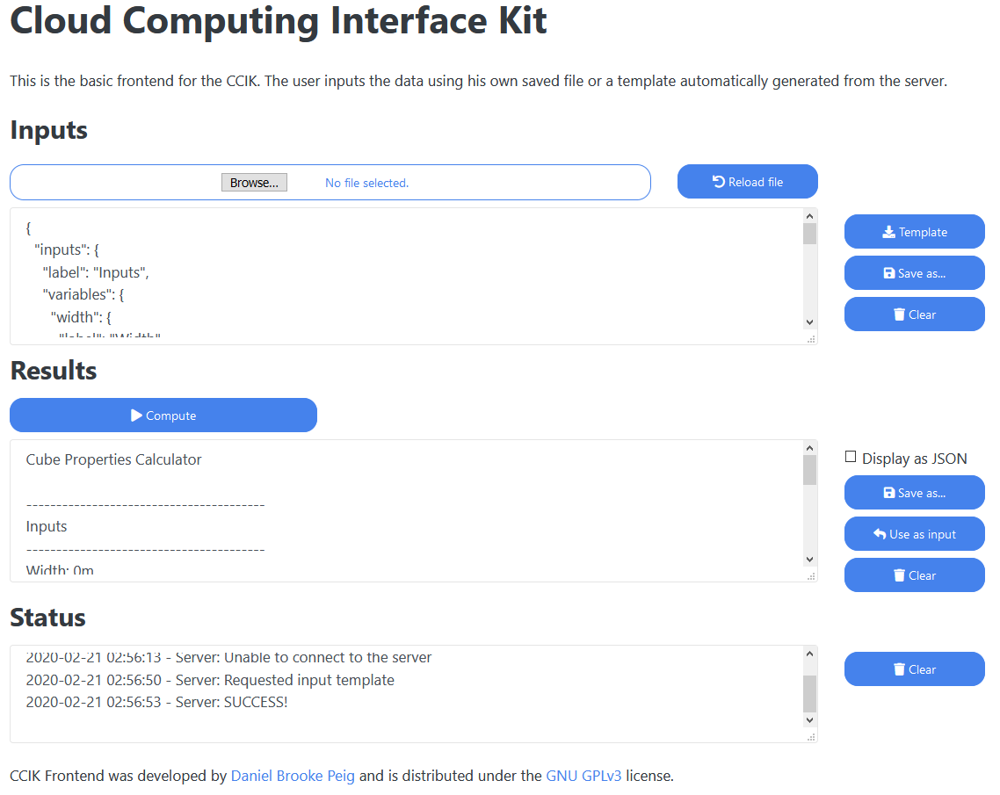

# Cloud Computing Interface Kit
Single page HTML frontend + Node.js backend boilerplate for remote calculations (REST) and data processing.

## What is the CCIK

CCIK is a simple user interface for programs that run on a remote server or locally. It is made of two parts, the frontend that has the actual user interface and the backend that performs the processing.

The frontend is a single HTML page that allows sending inputs (formatted as JSON) to a cloud based backend to be processed and then display the results/calculations.

The backend is a Node.js REST application that processes the inputs in the server side and returns the results to the frontend. It can also be used to interface other native programs running in the server.

Out of the box CCIK comes with an example of a server based calculation that takes some measures and calculates the properties of a cube.

## Frontend features
* Can run from a webserver, locally or from a webview app
* No server-side software required to display the frontend
* Bootstrap based theme
* Responsive design (mobile ready)
* Local validation of the JSON inputs and the JSON results
* Load input template/example from the server
* Load inputs from local files
* Save inputs as JSON
* Save results as JSON or TXT
* Display results as TXT
* Status log with local and server errors/messages and warnings

## Backend features
* REST based, can run from a server or locally
* Can be programmed to interface with native (binary executable) programs and libraries like Microsoft Excel
* Plain and simple Node.js + Express.js, no extra modules
* Compatible with encrypted and non-encrypted connections
* Input/output JSON validation and code injection protection
* Inputs structural check based on the built-in template
* Server side status messages displayed in the user status log

## Installation

### Backend
1. Install Node.js and make sure it was included in the system path
2. Unpack the contents of the *ccik-backend* folder
3. Open the *ccik-backend* folder from a terminal and type:
```
npm install
````
4. After Express.js was downloaded and installed use the following command to start the server:
```
node index.js
````

### Frontend
 1. Unpack the contents of the *ccik-frontent* folder to any place in your computer or in a webserver.
 2. Edit the *js/ccikfe.js* file and add the address and port of the destination server. The default will point to a local Node.js instance.
 3. Open the *index.html* file from any browser.

## FAQ

* **Why the input field can't be displayed as a pretty formatted text?** Because it would be much easier for the end user to corrupt the input structure. JSON has strict rules that prevent variable names to be confused with values. It also is a universal format.

* **Can I use the fronted to test another REST application made in a different language/platform?** Sure! Just make sure you are pointing to the correct routes in the server side and that you server reads and responds in the JSON format. Ensure you check the JSON box to prevent the model from trying to interpret the results format.


  